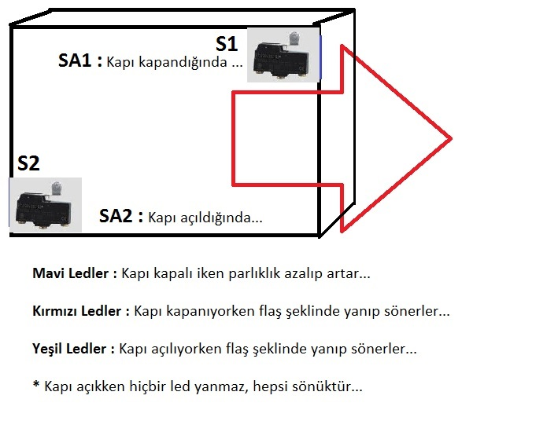
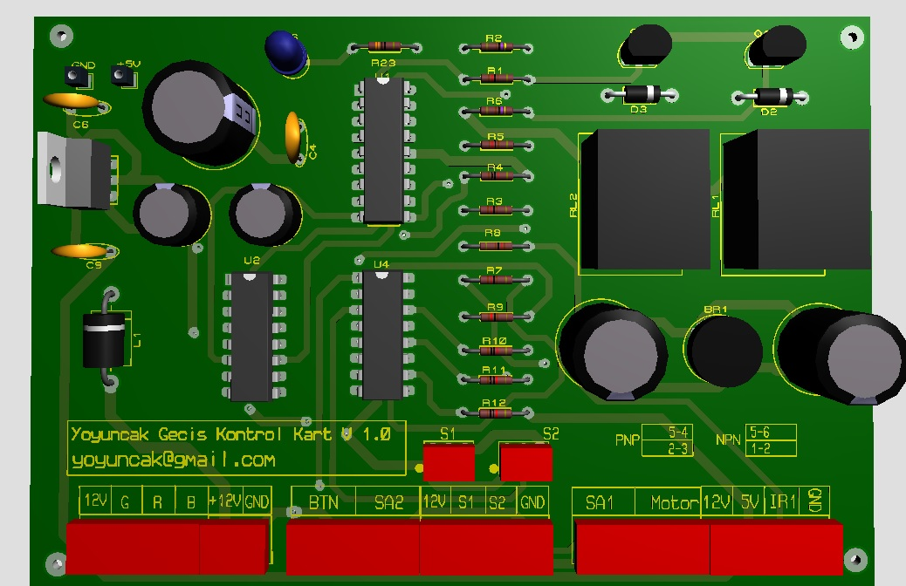

<h1 align="center">Otomatik Kayar Kapı</h1>

## İçerik

- [Giriş](#Giriş)
- [Çalışma Şekli](#Çalışma-Şekli)
- [Kullanılan Teknolojiler](#Kullanılan-Teknolojiler)
- [İletişim](#İletişim)

<!-- OVERVIEW -->

## Giriş

Kum havuzları vb. oyun alanları için oyun alanına girecek misafirin ücreti ödedikten sonra kasiyer tarafından  içeri alınmasını veya içerdeki misafirin dışarı çıkarılmasını sağlamak için kullanılan kayar kapıların kontrol sistemidir.

## Çalışma Şekli

Sistem tek bir butonla kontrol edilir. Eğer kapı kapalı ise butona basıldığında açılır. Açık ise butona basıldığında kapanır. Butona basılma işlemi her durumda kapının ters yöne gitmesini sağlar.

Kapının duracağı yerler iki adet sensör tarafından belirlenmektedir.

<br>
<p  align="center">
    
</p>
<div align="center"> Resim: Sensörlerin yerleşimi ev çalışma şekli. </div>
<br>


Kapının çalışma durumu uyarı ışıkları ile de gösterilmiştir.

Bu kapı sistemi sayesinde oyun alanından içeri girecek veya çıkacak misafirlerin kontrolü kolayca yapılabilmektedir.

<br>
<p  align="center">
    
</p>
<div align="center"> Resim: PCB. </div>
<br>

```bash

## Kullanılan Teknolojiler

- PIC16F628A mikrodenetleyici.
- Microchip XC8 derleyici.
- Sensörler.
- DC motor yön kontrolü.
- PCB devre şeması çizme ve oluşturma.

```

## Örnek çalışma videosu :

[](https://youtu.be/kIe9F6NFxtg)

## İletişim

- GitHub [@your-ilyas9461](https://github.com/ilyas9461)
- Linkedin [@your-linkedin](linkedin.com/in/ilyas-yağcioğlu-6a6b17217)

### *** Not : 
Devre endüstriyel olarak üretimde olduğu için PCB devre şemaları paylaşılmamıştır.
